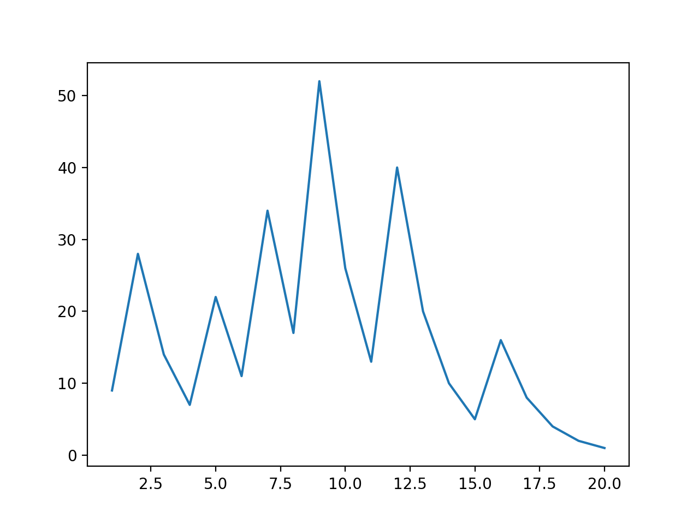

# Collatz-Conjecture
A Python function calculating Collatz conjecture's convergence

### Usage
```
>>> from Collatz import collatzSeq
>>> collatzSeq(9)
[9, 28, 14, 7, 22, 11, 34, 17, 52, 26, 13, 40, 20, 10, 5, 16, 8, 4, 2, 1]
```

### Bonus step
- install [Matplotlib](https://matplotlib.org)
```
$ python3 -m pip install --upgrade pip setuptools wheel
$ python3 -m pip install matplotlib
$ source bin/activate
```

- display Collatz sequence on a graph
```
(Collatz-Conjecture) $ python3
>>> from Collatz import collatzSeq
>>> import matplotlib.pyplot as plt
>>> yvalues = collatzSeq(9)
>>> xaxis = [i for i in range(1, len(yvalues) + 1)]
>>> plt.plot(xaxis, yvalues)
>>> plt.show()
```

- an image will be shown


